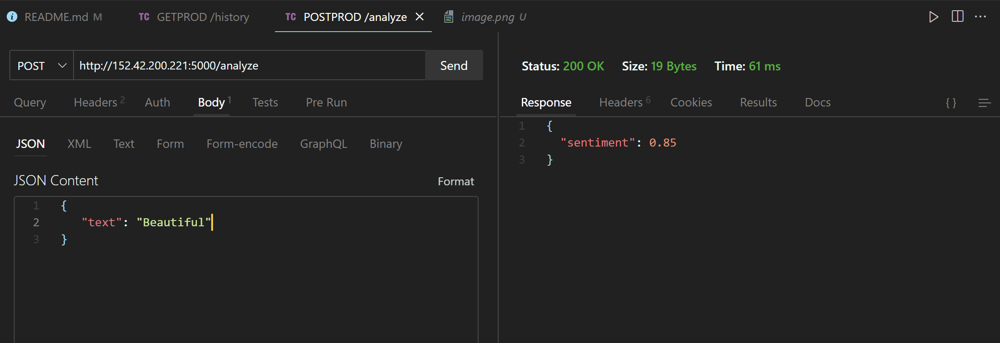
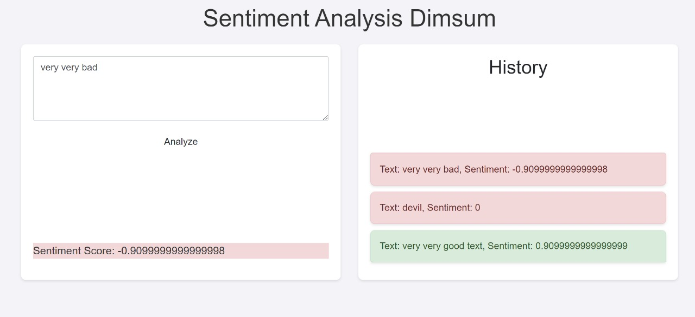
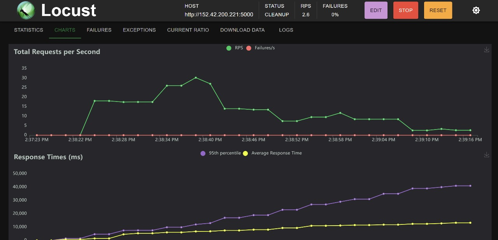
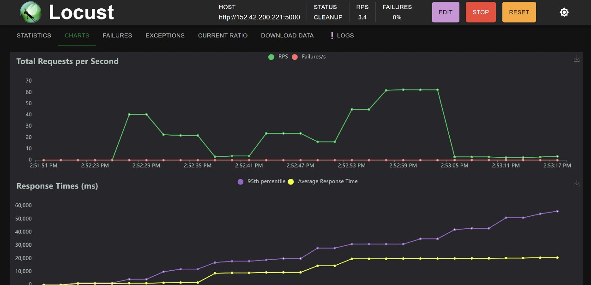
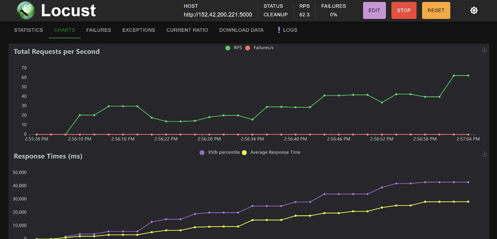
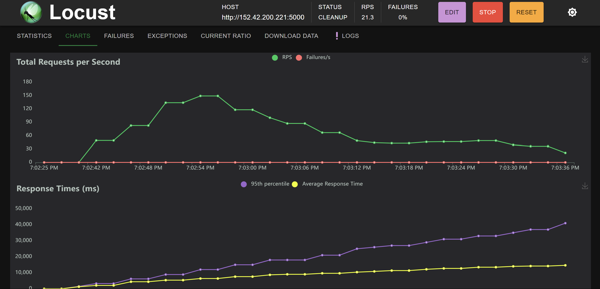
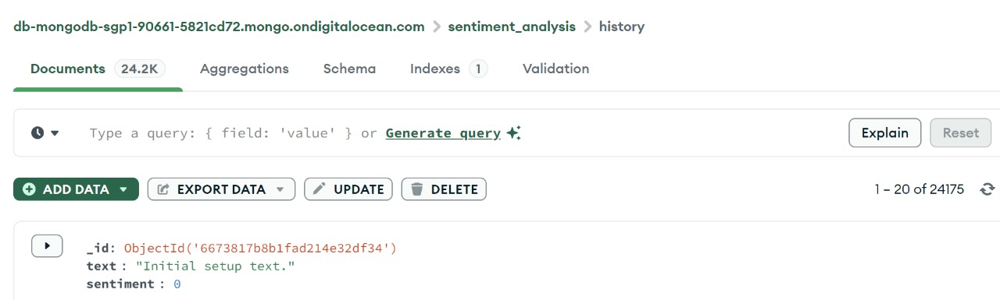

# Final Project Cloud Computing

**Kelompok B4**
|Nama|NRP |
|--|--|
|Dimas Andhika Diputra|5027231074|
|Rafael Ega Krisaditya|5027231025|
|Rafi Afnaan Fathurrahman|5027231040|
|Kevin Anugerah Faza|5027221027|
|Aryasatya Alaauddin|5027221082|

# I) Introduksi Permasalahan

Anda adalah seorang lulusan Teknologi Informasi, sebagai ahli IT, salah satu kemampuan yang harus dimiliki adalah **Keampuan merancang, membangun, mengelola aplikasi berbasis komputer menggunakan layanan awan untuk memenuhi kebutuhan organisasi.**

Pada suatu saat anda mendapatkan project untuk mendeploy sebuah aplikasi Sentiment Analysis dengan komponen Backend menggunakan python: sentiment-analysis.py dengan spesifikasi sebagai berikut

### Endpoints:

1. **Analyze Text**

   - **Endpoint:** `POST /analyze`
   - **Description:** This endpoint accepts a text input and returns the sentiment score of the text.
   - **Request:**
     ```json
     {
       "text": "Your text here"
     }
     ```
   - **Response:**
     ```json
     {
       "sentiment": <sentiment_score>
     }
     ```

2. **Retrieve History**
   - **Endpoint:** `GET /history`
   - **Description:** This endpoint retrieves the history of previously analyzed texts along with their sentiment scores.
   - **Response:**
     ```json
     {
      {
        "text": "Your previous text here",
        "sentiment": <sentiment_score>
      },
      ...
     }
     ```

---

Kemudian juga disediakan sebuah Frontend sederhana menggunakan [index.html](/Resources/FE/index.html) dan [styles.css](/Resources/FE/styles.css) dengan tampilan antarmuka sebagai berikut


Kemudian anda diminta untuk mendesain arsitektur cloud yang sesuai dengan kebutuhan aplikasi tersebut. Apabila dana maksimal yang diberikan adalah **1 juta rupiah per bulan (65 US$)**
konfigurasi cloud terbaik seperti apa yang bisa dibuat?

# II) Rancangan Arsitektur dan Tabel Harga Spesifikasi VM

Di revisi ini, kami mengubah rancangan arsitektur menjadi menggunakan 3 droplet VM dengan cloud provider **digital ocean**. Kami menggunakan 3 droplet VM dengan spesifikasi sebagai berikut:


Untuk ketiga VM kami menggunakan droplet VM digital ocean dengan spesifikasi tersebut, jadi total biaya yang kami keluarkan sekitar

> **3 VM x $21 = $63**

# III) Implementasi dan Konfigurasi Teknologi

da

# IV) Hasil Pengujian Setiap Endpoint

### Pengujian dengan Rest Client

1. Get All History


2. Create a New Text



### Pengujian dari Frontend




# V) Hasil Pengujian dan Analisis Loadtesting Locust

- RPS Maksimum (load testing 60 detik)

> **RPS Maksimum yang kami dapati dari beberapa stress test locust adalah ~890 RPS, didapatkan ketika di test dengan menggunakan spawn rate 500 dengan Peak Concurrency Maksimum sebesar 4000 User**

- Peak Concurrency Maksimum (spawn rate 50, load testing 60 detik)


> 500 PCM

<hr>

- Peak Concurrency Maksimum (spawn rate 100, load testing 60 detik)


> 1000 PCM

<hr>

- Peak Concurrency Maksimum (spawn rate 200, load testing 60 detik)


> 1600 PCM

<hr>

- Peak Concurrency Maksimum (spawn rate 500, load testing 60 detik)


> 2000 PCM

# VI) Kesimpulan dan Saran

Setelah percobaan yang kami lakukan berulang kali untuk testing locust ini, yang kami dapatkan adalah:

- Banyak hal yang mempengaruhi pengujian locust ini seperti **Koneksi internet, Peak concurrency yang diinput (bagian dari test), spawn rate yang diinput**
- Selain itu untuk spawn rate yang tinggi kami sempat beberapa kali mengalami vm backendnya ngelag. Solusi kami adalah untuk **mereset database tiap ingin menguji locust**. Hal itu sangat berpengaruh tiap kali ingin mengetest dengan uji locust, dikarenakan banyaknya data yang diinput oleh locust untuk pengujiannya

> Seperti gambar berikut, kami sempat mendapatkan bahwa data di database kami sempat ada 24k (kami mendapatkan ini sebelum menyadari bahwa data yang diinput oleh locust dalam pengujian sangat banyak)


