# Final Project Cloud Computing

**Kelompok B4**
|Nama|NRP |
|--|--|
|Dimas Andhika Diputra|5027231074|
|Rafael Ega Krisaditya|5027231025|
|Rafi Afnaan Fathurrahman|5027231040|
|Kevin Anugerah Faza|5027221027|
|Aryasatya Alaauddin|5027221082|

Demo Youtube: https://youtu.be/SdVI43f2Rxo

# I) Introduksi Permasalahan

Anda adalah seorang lulusan Teknologi Informasi, sebagai ahli IT, salah satu kemampuan yang harus dimiliki adalah **Keampuan merancang, membangun, mengelola aplikasi berbasis komputer menggunakan layanan awan untuk memenuhi kebutuhan organisasi.**

Pada suatu saat anda mendapatkan project untuk mendeploy sebuah aplikasi Sentiment Analysis dengan komponen Backend menggunakan python: sentiment-analysis.py dengan spesifikasi sebagai berikut

### Endpoints:

1. **Analyze Text**

   - **Endpoint:** `POST /analyze`
   - **Description:** This endpoint accepts a text input and returns the sentiment score of the text.
   - **Request:**
     ```json
     {
       "text": "Your text here"
     }
     ```
   - **Response:**
     ```json
     {
       "sentiment": <sentiment_score>
     }
     ```

2. **Retrieve History**
   - **Endpoint:** `GET /history`
   - **Description:** This endpoint retrieves the history of previously analyzed texts along with their sentiment scores.
   - **Response:**
     ```json
     {
      {
        "text": "Your previous text here",
        "sentiment": <sentiment_score>
      },
      ...
     }
     ```

---

Kemudian juga disediakan sebuah Frontend sederhana menggunakan [index.html](/Resources/FE/index.html) dan [styles.css](/Resources/FE/styles.css) dengan tampilan antarmuka sebagai berikut

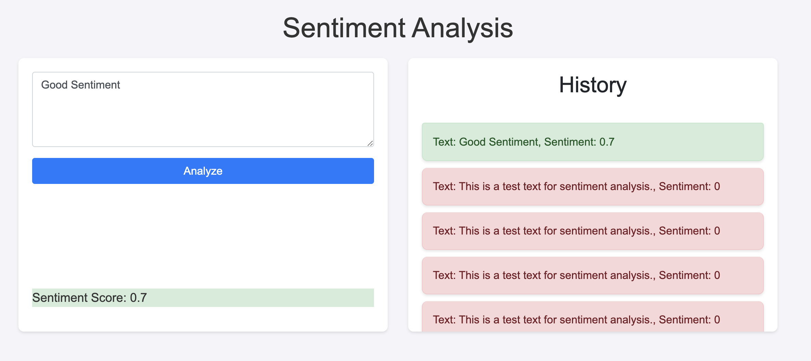

Kemudian anda diminta untuk mendesain arsitektur cloud yang sesuai dengan kebutuhan aplikasi tersebut. Apabila dana maksimal yang diberikan adalah **1 juta rupiah per bulan (65 US$)**
konfigurasi cloud terbaik seperti apa yang bisa dibuat?

# II) Rancangan Arsitektur dan Tabel Harga Spesifikasi VM

Di revisi ini, kami mengubah rancangan arsitektur menjadi menggunakan 3 droplet VM dengan cloud provider **digital ocean**. Kami menggunakan 3 droplet VM dengan spesifikasi sebagai berikut:

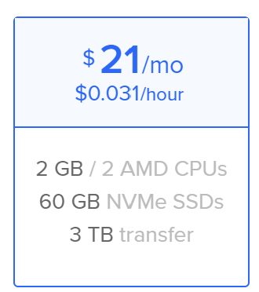

Total biaya yang kami keluarkan sekitar **3 VM x $21 = $63**. Berikut adalah preview droplet yang kami buat:

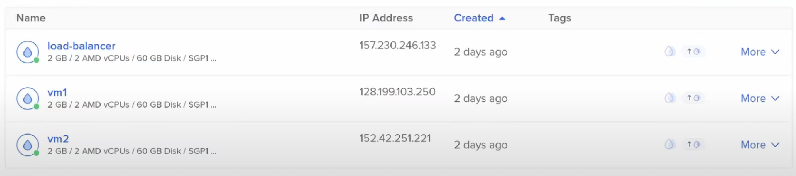

# III) Implementasi dan Konfigurasi Teknologi

Untuk konfigurasi dari arsitektur yang telah kami buat terbagi menjadi 2, yaitu konfigurasi untuk worker (2 vm), dan konfigurasi untuk load balancer dari worker tersebut (1 vm)

### Konfigurasi Worker

VM untuk setiap worker kami install beberapa dependencies:

- Nginx untuk frontend
- Python3-pip, Python3-venv (virtual environment) untuk setup aplikasi flasknya (backend)
  - Flask: Framework backend yang kami pakai.
  - Flask-CORS: Digunakan untuk mengatasi masalah Cross-Origin Resource Sharing (CORS) di aplikasi Flask.
  - TextBlob: Library untuk pemrosesan teks dan analisis sentimen di aplikasi Python.
  - PyMongo: Driver resmi MongoDB untuk Python yang digunakan untuk menghubungkan dan berinteraksi dengan database MongoDB.
  - Gunicorn: HTTP server untuk aplikasi Python WSGI, sering digunakan untuk menjalankan aplikasi Flask di prod.
  - Gevent: Library untuk concurrency di Python, memungkinkan aplikasi untuk menangani banyak koneksi secara efisien.
- MongoDB database untuk menyimpan hasil sentimen beserta teksnya

#### **Setup Frontend:**

```
sudo apt-get update
sudo apt-get install nginx
```

setelah menginstall nginx seharusnya kita mendapatkan file dan direktori baru oleh nginx seperti direktori `/var/www/html` dan `/etc/nginx/sites-available/`

setelah itu kita bisa langsung clone repository `fp-tka` untuk mendapatkan resources file frontendnya dan memindahkannya ke folder `/var/www/html` agar diserve oleh nginx

(posisi di root)

```
git clone https://github.com/fuaddary/fp-tka.git
mv fp-tka/Resources/FE/index.html /var/www/html/index.html
mv fp-tka/Resources/FE/styles.css /var/www/html/styles.css
sudo systemctl restart nginx
```

setelah file frontend diserve seharusnya kita bisa melihat tampilan frontend di ip tersebut

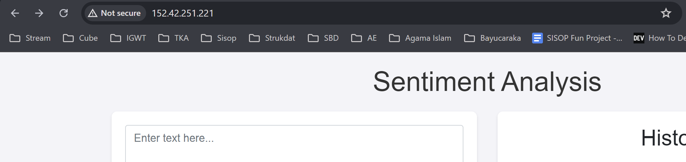

setelah itu kita masih perlu setup beberapa konfigurasi baik dari `file htmlnya` maupun konfigurasi file `/etc/nginx/sites-available/default`, karena kami ingin agar dalam **worker tersebut frontend dan backend bekerja dalam port yang sama, agar pada saat load balance kita bisa mengakses frontend dan backend di port yang sama ke 2 worker yang telah kami buat**. Pertama kami ubah url fetch di dalam htmlnya menjadi hanya `/history` dan `/analyze`

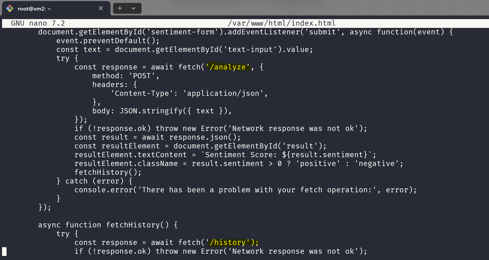

setelah itu perlu juga untuk mengubah konfigurasi file `default` di `/etc/nginx/sites-available/default` karena **yang diserve di port default 80 adalah nginx, kita tidak bisa langsung mengakses endpoint backend dengan menjalankan backend tersebut di port 80, kita harus mengubah konfigurasi nginx terlebih dahulu**

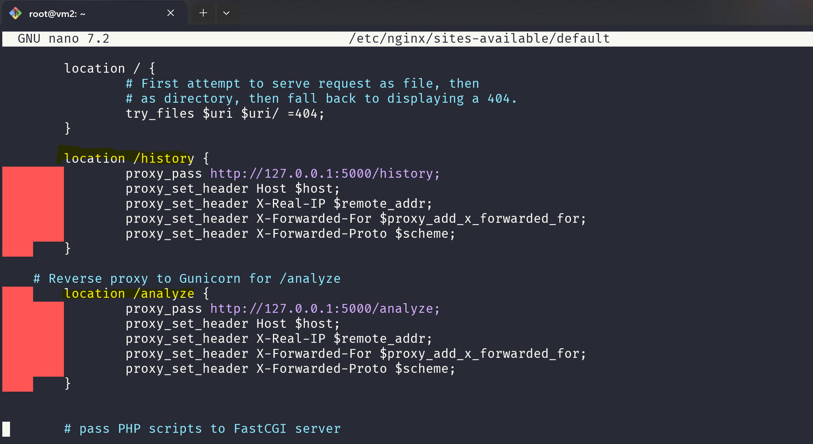

lalu kita restart ulang service nginxnya

```
sudo systemctl restart nginx
```

selesai, setup untuk frontend sudah selesai dan siap untuk digunakan

#### **Setup Backend:**

Untuk backend kita pertama perlu menginstall pip dan virtual environment

```
sudo apt-get update
sudo apt-get install python3-pip python3-venv
```

karena sudah clone repo github `fp-tka` sebelumnya jadi kita tinggal pakai file yang sudah di clone sebelumnya, kita perlu masuk ke direktori `fp-tka/Resources/BE`, membuat virtual environment, dan install semua dependencies python yang sudah disebutkan sebelumnya

```
cd fp-tka/Resources/BE
python3 -m venv venv
source venv/bin/activate
```

setelah itu seharusnya tampilan dari prompt terminal sedikit berubah, dan package python telah terisolasi

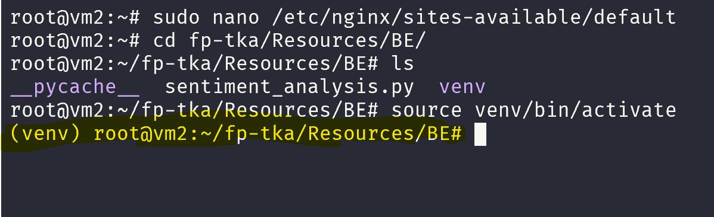

jika tampilan prompt terminal sudah berubah seperti gambar di atas kita bisa install package python yang diperlukan

```
pip install flask flask-cors textblob pymongo gunicorn gevent
```

setelah itu kita bisa harus ubah nama file pythonnya terlebih dahulu dari `sentiment-analysis.py` menjadi `sentiment_analysis.py` dan langsung menjalankan backend aplikasi flask dengan daemon tanpa konfigurasi lain2

```
gunicorn -b 0.0.0.0:80 -w 5 -k gevent --timeout 60 --graceful-timeout 60 sentiment_analysis:app --daemon
```

- gunicorn: Menjalankan Gunicorn, WSGI HTTP server untuk aplikasi Python
- -b 0.0.0.0:80: Bind server ke alamat IP 0.0.0.0 pada port 80. Server akan dapat diakses dari semua alamat IP yang dapat menjangkau server.
- -w 5: Menentukan jumlah worker yang akan dijalankan oleh Gunicorn. Dalam hal ini, 5 worker.
- -k gevent: Menggunakan worker tipe gevent, yang mendukung concurrency dengan menggunakan greenlet untuk menangani banyak koneksi secara efisien.
- --timeout 60: Menentukan waktu maksimum dalam detik yang diizinkan untuk setiap request sebelum worker dibunuh dan direstart.
- --graceful-timeout 60: Menentukan waktu tambahan dalam detik yang diberikan kepada worker untuk menyelesaikan request yang sedang diproses sebelum dipaksa untuk berhenti.
- sentiment_analysis:app: Menunjukkan modul dan aplikasi Flask yang akan dijalankan oleh Gunicorn. sentiment_analysis adalah nama modul, dan app adalah instance aplikasi Flask.
- --daemon: Menjalankan Gunicorn dalam mode daemon, sehingga proses akan berjalan di latar belakang.

Jika sudah berhasil seharusnya kita juga bisa akses endpoint backend di vm tersebut dengan port 80

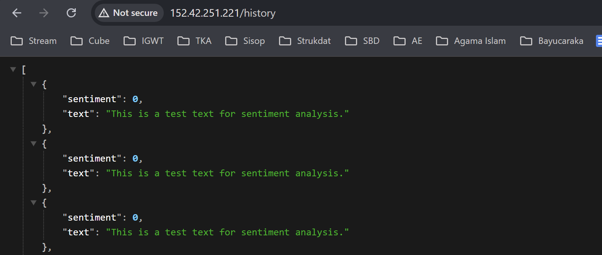<br>

# IV) Hasil Pengujian Setiap Endpoint

### Pengujian dengan Rest Client (Salah satu vm)

1. Get All History

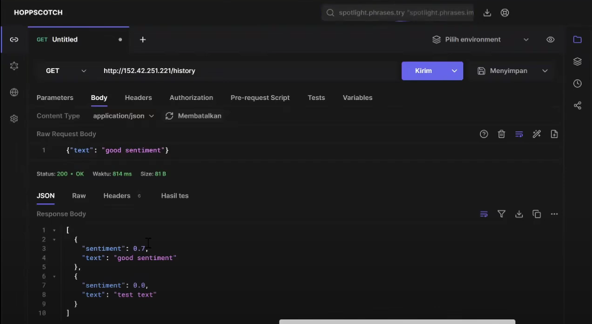

2. Create a New Text

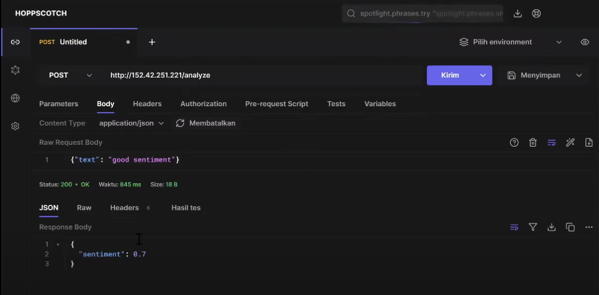

### Pengujian dari Frontend (Salah satu vm)

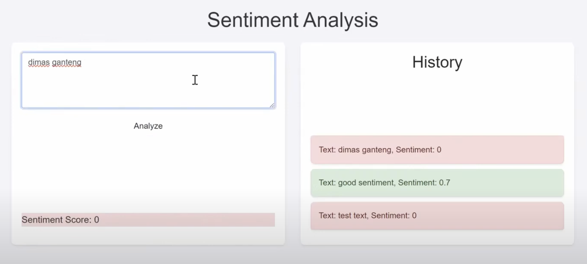

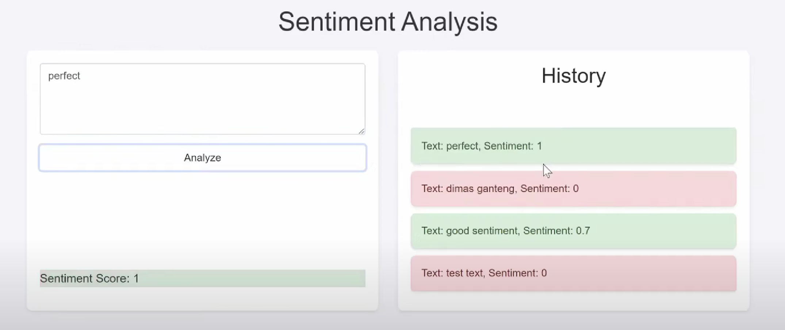<br>

# V) Hasil Pengujian dan Analisis Loadtesting Locust

- RPS Maksimum (load testing 60 detik)

> **RPS Maksimum yang kami dapati dari beberapa stress test locust adalah ~900-1000 RPS**

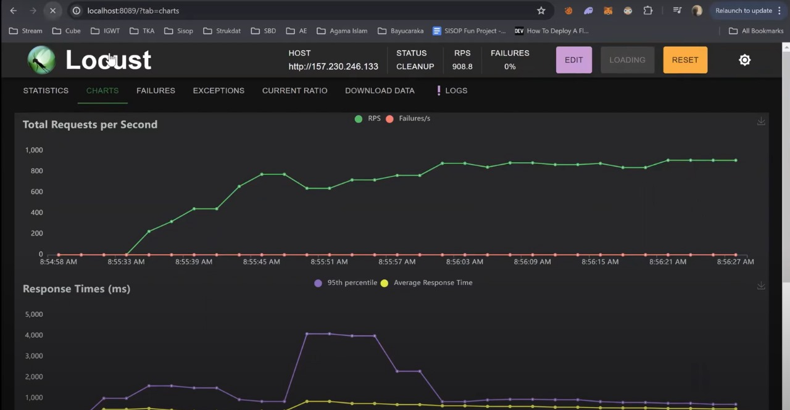

<hr>

- Peak Concurrency Maksimum **1000** (**spawn rate 50**, load testing 60 detik)

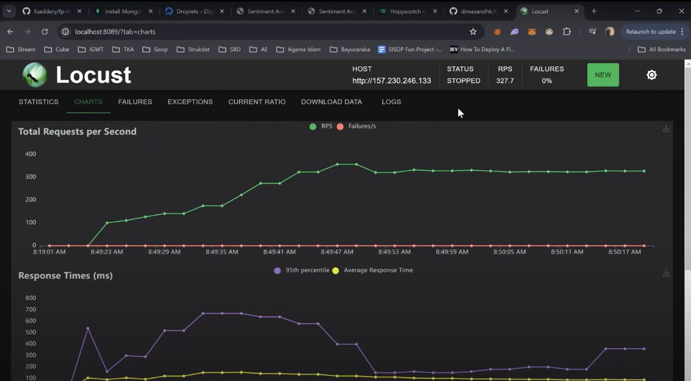

<hr>

- Peak Concurrency Maksimum **2000** (**spawn rate 100**, load testing 60 detik)

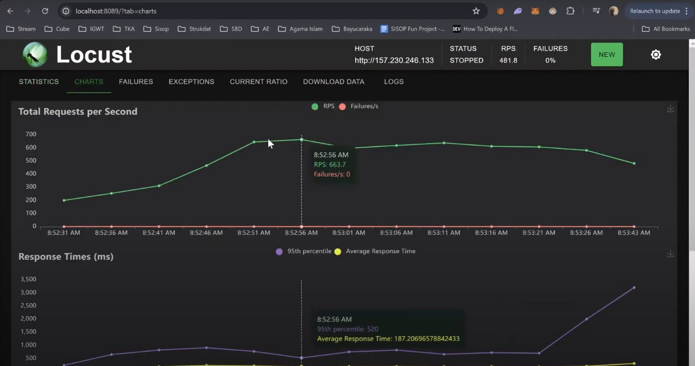

<hr>

- Peak Concurrency Maksimum **3000** (**spawn rate 200**, load testing 60 detik)


<hr>

- Peak Concurrency Maksimum **4000** (**spawn rate 500**, load testing 60 detik)

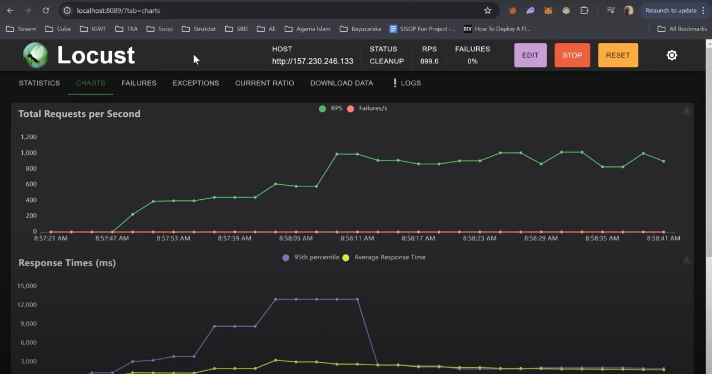

# VI) Revisi, Kesimpulan, dan Saran

### REVISI

Setelah melakukan beberapa konfigurasi ulang, berikut ini adalah poin-poin pentingnya:

- Hasil pengujian locust menunjukkan bahwa rancangan layanan awan dapat menampung beban hingga 1015 Requests per Second (RPS) tanpa adanya failures satupun. Namun, waktu respons mulai meningkat secara signifikan setelah mencapai sekitar +- 600 RPS yang menunjukkan adanya limit atau bottleneck yang terjadi dimana konfigurasi kami mulai kewalahan untuk melakukan handle requests.
- Sepanjang pengujian tidak ada satupun failures yang diberikan oleh locust yang mengindikasikan bahwa rancangan layanan awan stabil dan tidak mengalami error meskipun beban requests yang diberikan sangat tinggi.
- Waktu respons rata-rata (Average Response Time)) cukup stabil berkisar antara 200ms pada beban yang tidak tinggi hingga menengah, tetapi relatif meningkat saat mengalami beban tinggi.
- Maximum Capacity yang didapatkan berdasarkan uji locust kali ini secara efektif berkisar antara 600-700 RPS dengan tidak ada kendala apapun pada layanan awan. Namun mulai mengalami pengurangan performa sehingga menyebabkan layanan bisa berjalan tidak secara maksimal saat diatasnya

### KESIMPULAN

Hasil pengujian Locust menunjukkan bahwa rancangan layanan awan dapat menampung beban hingga 1015 Requests per Second (RPS) tanpa adanya kegagalan, mengindikasikan bahwa arsitektur cloud yang digunakan stabil dan tidak mengalami error meskipun di bawah beban yang sangat tinggi. Namun, waktu respons mulai meningkat secara signifikan setelah mencapai sekitar 600 RPS, menunjukkan adanya limit atau bottleneck di mana konfigurasi mulai kewalahan menangani permintaan. Waktu respons rata-rata stabil di sekitar 200 ms pada beban rendah hingga menengah, tetapi meningkat pada beban tinggi. Kapasitas maksimum yang didapatkan dapat mencapai 1015 RPS dengan efektivitas berkisar antara 600-700 RPS, setelah itu performa menurun sehingga layanan tidak berjalan secara optimal di atas beban tersebut.

--------------------d<br>
**Ini kesimpulan saran sebelumnya ges**

Setelah percobaan yang kami lakukan berulang kali untuk testing locust ini, yang kami dapatkan adalah:

- Banyak hal yang mempengaruhi pengujian locust ini seperti **Koneksi internet, Peak concurrency yang diinput (bagian dari test), spawn rate yang diinput**
- Selain itu untuk spawn rate yang tinggi kami sempat beberapa kali mengalami vm backendnya ngelag. Solusi kami adalah untuk **mereset database tiap ingin menguji locust**. Hal itu sangat berpengaruh tiap kali ingin mengetest dengan uji locust, dikarenakan banyaknya data yang diinput oleh locust untuk pengujiannya

> Kami sempat mendapatkan bahwa data di database kami sempat ada 24k (kami mendapatkan ini sebelum menyadari bahwa data yang diinput oleh locust dalam pengujian sangat banyak)
